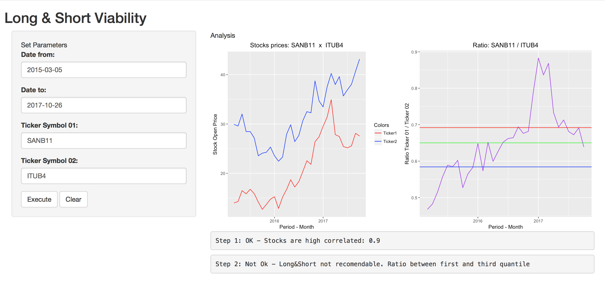

Long & Short Analysis
========================================================
Course Project: Shiny Application and Reproducible Pitch  

Rodrigo Chagas  
20-10-2017


Long&Short: Definition
========================================================
<font size = "4px">
- Long Position: An investor who owns 100 shares of some stock in his portfolio is said to be Long 100 shares. This investor has paid in full the cost of owning the shares. 
- Short Position: An investor who has sold 100 shares without currently owning those shares is said to be Short 100 shares. 

1. The **short investor** owes 100 shares at settlement and must fulfill the obligation by purchasing the shares in the market to deliver.  

2. Oftentimes, the short investor borrows the shares from a brokerage firm in a margin account to make the delivery.  

3. Then, with hopes the stock price will fall, the investor buys the shares at a lower price to pay back the dealer who loaned them.  

4. If the price doesn't fall and keeps going up, the short seller may be subject to a margin call from his broker.

Source
<http://www.investopedia.com/ask/answers/100314/whats-difference-between-long-and-short-position-market.asp>.
</font>
App Objective
========================================================
<font size = "4px">
Find prices asymmetries between two companies that are historically high correlated.
This App will use 4 **inputs**:
- **Date From** and **Date To**: Period of analysis
- **Ticker 1** and **Ticker 2**: Stocks to be compared  

The output is a **recomendation** to do or do not a Long&Short:  

1. Check if the shares are high correlated considering as threshold 0.80 for correlation coefficient.  
2. Calcutate a ratio between shares Ticker1/Ticker2  

3. Calculate the quantiles and check where the ratio is.  

4. If the shares are high correlated and the current ratio value is upper of the third quantile recomend a Long&Ahort operation doing Short for Ticker 01 and Long for Ticker 02

5. If the shares are high correlated and the current ratio value is lower of the first quantile recomend a Long&Ahort operation doing Long for Ticker 01 and Short for Ticker 02

6. Otherwise do not recomend 

</font>

Example Command
========================================================
<font size = "4px">
This app use the function getSymbols from quantmod package. It will receive the 4 input parameters to retrieve the 2 tickers information: DateTo and DateFrom + Ticker code. Please see bellow.


```r
         data.stock1 <- getSymbols(Ticker1, src="google", 
                                   from = as.Date(DateFrom), to=as.Date(DateTo))
         data.stock2 <- getSymbols(as.character(Ticker2),src="google", 
                                   from = as.Date(DateFrom), to=as.Date(DateTo))
```
So, as you can see those field inputs are mandatory. After input values on that clik at Execute Button.
</font>
How it looks like
========================================================




